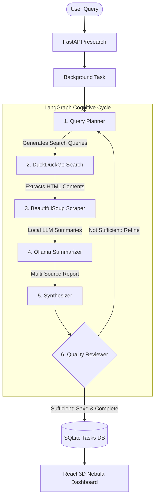

# 🌌 Autonomous AI Research Agent

An autonomous, stateful research agent powered by **LangGraph** orchestration, **FastAPI** backend, and local LLMs (**Ollama**). It is paired with a **premium React 3D HUD telemetry dashboard** built using Three.js, React Three Fiber, Framer Motion, and TailwindCSS for real-time visual monitoring of cognitive agent steps.

---

## 🌟 Key Features

- **🧠 Stateful Cognitive Graph**: Leverages LangGraph for self-correcting iterative loops (Query Planner ➡️ Search ➡️ Scrape ➡️ Summarize ➡️ Synthesize ➡️ Quality Reviewer).
- **🔌 Fully Local & Privacy-Focused**: Summarization and synthesis are executed entirely on your machine using local models (e.g., Llama 3) via **Ollama**.
- **🌐 Dynamic Multi-Source Search**: Automates duckduckgo search-queries generation and parallel source harvesting.
- **🛡️ Robust Scraper Pipeline**: Extraction logic using BeautifulSoup with user-agent rotation and rate-limiting buffers.
- **🔮 3D Telemetry HUD**: A stunning, premium React interface featuring dynamic camera rigs, interactive canvas nodes, nebula particle fields, and a scrolling command terminal highlighting ongoing agent logs.
- **⚡ Background Worker Engine**: Runs long-running research tasks asynchronously using FastAPI's background workers and maintains task status in SQLite.

---

## 📐 Architecture Overview



### LangGraph Stateful Cycle
1. **Query Planner**: Analyzes user query, initializes task state, and creates targeted search terms.
2. **Search Node**: Executes searches against DuckDuckGo API to collect highly relevant candidate URLs.
3. **Scrape Node**: Fetches and extracts main text content from collected URLs while handling exceptions.
4. **Summarize Node**: Generates concise structural summaries of fetched contents using local Ollama LLM.
5. **Synthesizer**: Synthesizes all source material into a structured, cohesive multi-section markdown report.
6. **Quality Reviewer**: Assesses the report's comprehensiveness. If gaps exist, loops back to the *Query Planner* with refined queries. Otherwise, terminates and saves the final result.

---

## 🚀 Quick Start Guide

### Prerequisites

1. **Ollama (Local LLM)**
   - Download and install Ollama from [ollama.ai](https://ollama.ai).
   - Pull the required model:
     ```bash
     ollama pull llama3
     ```
   - Ensure the Ollama server is running (default port is `11434`).

---

### Option A: Running with Docker (Recommended)

Quickly boot the entire ecosystem (FastAPI Backend + SQLite + Vite React Frontend) with a single command:

```bash
docker-compose up --build
```
- **FastAPI API Server**: `http://localhost:8000`
- **React Frontend HUD**: `http://localhost:3000`

---

### Option B: Local Setup

#### 1. Backend Setup (FastAPI)
1. **Navigate to project root** and create/activate a virtual environment:
   ```bash
   python -m venv venv
   # Windows:
   .\venv\Scripts\activate
   # Linux/Mac:
   source venv/bin/activate
   ```
2. **Install dependencies**:
   ```bash
   pip install -r requirements.txt
   ```
3. **Start the API Server**:
   ```bash
   python src/main.py
   ```
   *The backend will be available at `http://localhost:8000`.*

#### 2. Frontend Setup (React 3D HUD)
1. **Navigate to the frontend directory**:
   ```bash
   cd frontend
   ```
2. **Install dependencies**:
   ```bash
   npm install
   ```
3. **Run the local Vite development server**:
   ```bash
   npm run dev
   ```
   *The frontend dashboard will be available at `http://localhost:3000`.*

---

## 🛰️ API Reference

### 1. Initiate a Research Task
- **Endpoint**: `POST /research`
- **Payload**:
  ```json
  {
    "query": "The impact of quantum computing on cryptography in 2026",
    "template": "DEEP_DIVE"
  }
  ```
  *Templates available: `DEEP_DIVE`, `EXECUTIVE_BRIEF`, `COMPARATIVE_ANALYSIS`.*
- **Response**:
  ```json
  {
    "task_id": "8b51d1bc-4e6f-47dc-98df-82db2e646ebf",
    "status": "processing"
  }
  ```

### 2. Fetch Task Status & Real-Time Logs
- **Endpoint**: `GET /status/{task_id}`
- **Response**:
  ```json
  {
    "status": "completed",
    "result": {
      "query": "The impact of quantum computing on cryptography in 2026",
      "final_report": "# Quantum Computing Impact...",
      "sources": [
        "https://example.com/quantum-security",
        "https://example.com/post-quantum-crypto"
      ],
      "logs": [
        "[14:10:05] INITIALIZING COGNITIVE INTERFACE...",
        "[14:10:06] BOOTING COGNITIVE ORCHESTRATOR GRAPH...",
        "[14:10:15] HARVESTED 5 RELEVANT WEB SOURCES...",
        "[14:11:42] MISSION LOGS SAVED. TERMINATING GRAPH PROCESS."
      ],
      "current_step": "complete"
    }
  }
  ```

---

## 📂 Project Repository Structure

```text
├── src/                    # FastAPI Backend Source
│   ├── agent/              # LangGraph Stateful Agent Orchestrator
│   │   ├── graph.py        # Graph Compile and Loop Definitions
│   │   ├── nodes.py        # Planner, Search, Scrape, Summarize, Synthesize, Review Nodes
│   │   └── state.py        # Pydantic/TypedDict state schema
│   ├── tools/              # Specialized Core Tools (DDG Search, Scraper, LLM client)
│   └── main.py             # FastAPI App, SQLite persistence, and Task endpoints
├── frontend/               # Premium React 3D HUD Dashboard
│   ├── src/
│   │   ├── components/     # Canvas nodes, CameraRigs, Custom scrolling Terminal HUD
│   │   ├── store/          # Zustand global telemetry store
│   │   └── App.tsx         # Dashboard UI Wrapper
│   ├── vite.config.ts      # Vite configuration
│   └── package.json        
├── Dockerfile              # Backend Container Configuration
├── docker-compose.yml      # Multi-container setup file
├── DEPLOYMENT.md           # Standalone Server Deployment Guide
└── PROJECT.md              # Architectural Specifications & Core Goals
```

---

## 🛡️ License

This project is licensed under the MIT License. Feel free to clone, adapt, and build upon this autonomous agent.
