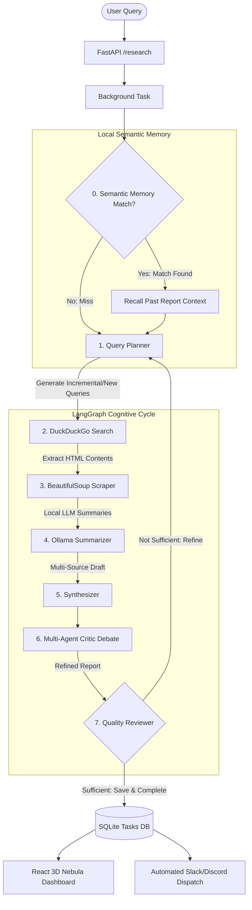

# 🌌 Autonomous AI Research Agent

An autonomous, stateful research agent powered by **LangGraph** orchestration, **FastAPI** backend, and local LLMs (**Ollama**). It is paired with a **premium React 3D HUD telemetry dashboard** built using Three.js, React Three Fiber, Framer Motion, and TailwindCSS for real-time visual monitoring of cognitive agent steps.

---

## 🌟 Key Features

- **🧠 Stateful Cognitive Graph**: Leverages LangGraph for self-correcting iterative loops (Planner ➡️ Search ➡️ Scrape ➡️ Summarize ➡️ Synthesize ➡️ Multi-Agent Debate ➡️ Quality Reviewer).
- **💾 Local Semantic Memory (Astral Core Archive)**: Dynamically checks SQLite `tasks.db` for past semantically overlapping queries using local LLMs. If matched, it recalls historical dossiers to perform incremental learning.
- **👥 Multi-Agent Critic Debate**: Simulates a closed-loop debate node where a **Skeptic Critic** audits drafts for contradictions, bias, or gaps, and an **Optimist Researcher** refines the final report.
- **🔌 Fully Local & Privacy-Focused**: Summarization, synthesis, semantic matching, and debates are executed entirely on your machine using local models (e.g., Llama 3) via **Ollama**.
- **🌐 Dynamic Multi-Source Search & Scraping**: Automates search term generation, harvests parallel sources using DuckDuckGo, and extracts raw text using a buffered BeautifulSoup scraper.
- **🔮 3D Interactive Source Constellation**: A premium React interface featuring dynamic camera rigs, floating glowing 3D orbital satellites (sources) that can be clicked to inspect details, and scrolling telemetry HUDs.
- **⚡ Exporters & Webhook Dispatches**: Auto-compiles PDF-ready themed HTML (Corporate, Academic, Neon Tech), board-ready Marp slide decks, and sends active embeds/blocks to Discord or Slack upon task completion.

---

## 📐 Architecture Overview



### LangGraph Stateful Cycle
0. **Local Semantic Memory Recall**: Checks historical DB records. If a matching query is found, the previous report is loaded to serve as structural context.
1. **Query Planner**: Analyzes user query, processes memory context, and outputs 3 target search terms designed to collect new or updated data.
2. **Search Node**: Executes DuckDuckGo API queries to collect relevant web links.
3. **Scrape Node**: Crawls crawled URLs, parses the main text, and logs connection statuses.
4. **Summarize Node**: Generates concise findings and key takeaways from each source text in parallel using a local LLM.
5. **Synthesizer**: Synthesizes all source material into a structured, cohesive multi-section report based on the active template (`DEEP_DIVE`, `EXECUTIVE_BRIEF`, `COMPARATIVE_ANALYSIS`).
6. **Multi-Agent Critic Debate**: Runs a critique-refinement debate between the `Skeptic Critic` and `Optimist Researcher` to correct contradictions and omissions.
7. **Quality Reviewer**: Assesses sufficiency. If gaps are identified, loops back to the *Query Planner* for refinement. Otherwise, saves the final dossier.

---

## 🚀 Quick Start Guide

### Prerequisites

1. **Ollama (Local LLM)**
   - Download and install Ollama from [ollama.ai](https://ollama.ai).
   - Pull the required model:
     ```bash
     ollama pull llama3
     ```
   - Ensure the Ollama server is running (default port is `11434`).

---

### Option A: Running with Docker (Recommended)

Quickly boot the entire ecosystem (FastAPI Backend + SQLite + Vite React Frontend) with a single command:

```bash
docker-compose up --build
```
- **FastAPI API Server**: `http://localhost:8000`
- **React Frontend HUD**: `http://localhost:3000`

---

### Option B: Local Setup

#### 1. Backend Setup (FastAPI)
1. **Navigate to project root** and create/activate a virtual environment:
   ```bash
   python -m venv venv
   # Windows:
   .\venv\Scripts\activate
   # Linux/Mac:
   source venv/bin/activate
   ```
2. **Install dependencies**:
   ```bash
   pip install -r requirements.txt
   ```
3. **Start the API Server**:
   ```bash
   python src/main.py
   ```
   *The backend will be available at `http://localhost:8000`.*

#### 2. Frontend Setup (React 3D HUD)
1. **Navigate to the frontend directory**:
   ```bash
   cd frontend
   ```
2. **Install dependencies**:
   ```bash
   npm install
   ```
3. **Run the local Vite development server**:
   ```bash
   npm run dev
   ```
   *The frontend dashboard will be available at `http://localhost:3000`.*

---

## 🛰️ API Reference

### 1. Initiate a Research Task
- **Endpoint**: `POST /research`
- **Payload**:
  ```json
  {
    "query": "The impact of quantum computing on cryptography in 2026",
    "template": "DEEP_DIVE",
    "webhook_url": "https://discord.com/api/webhooks/..." 
  }
  ```
  *Templates available: `DEEP_DIVE`, `EXECUTIVE_BRIEF`, `COMPARATIVE_ANALYSIS`. Webhook support is compatible with Discord and Slack formatting.*
- **Response**:
  ```json
  {
    "task_id": "8b51d1bc-4e6f-47dc-98df-82db2e646ebf",
    "status": "processing"
  }
  ```

### 2. Fetch Task Status & Real-Time Logs
- **Endpoint**: `GET /status/{task_id}`
- **Response**:
  ```json
  {
    "status": "completed",
    "result": {
      "query": "The impact of quantum computing on cryptography in 2026",
      "final_report": "# Quantum Computing Impact...",
      "sources": [
        "https://example.com/quantum-security",
        "https://example.com/post-quantum-crypto"
      ],
      "logs": [
        "[14:10:05] INITIALIZING COGNITIVE INTERFACE...",
        "[14:10:06] BOOTING COGNITIVE ORCHESTRATOR GRAPH...",
        "[14:10:15] HARVESTED 5 RELEVANT WEB SOURCES...",
        "[14:10:48] [AGENT DEBATE] SKEPTIC CRITIC: Draft report analyzed. Submitting structural feedback...",
        "[14:10:55] [AGENT DEBATE] OPTIMIST RESEARCHER: Critic feedback integrated, finalizing dossier...",
        "[14:11:42] MISSION LOGS SAVED. TERMINATING GRAPH PROCESS."
      ],
      "current_step": "complete"
    }
  }
  ```

### 3. Export Research Dossier & Board-Ready Slide Decks
- **Endpoint**: `GET /export/{task_id}?format={format}&theme={theme}`
  *   **Format**: `html` (renders live document) or `slides` (outputs Marp presentation code)
  *   **Theme** (only for html format): `corporate` (Slate-blue high-tech), `academic` (Double-ruled classic serif), or `tech` (Minimalist solid neon)

---

## 📂 Project Repository Structure

```text
├── src/                    # FastAPI Backend Source
│   ├── agent/              # LangGraph Stateful Agent Orchestrator
│   │   ├── graph.py        # Graph Compile and Loop Definitions
│   │   ├── nodes.py        # Planner (with Semantic Memory), Search, Scrape, Summarize, Synthesize, Critic Debate, Review Nodes
│   │   └── state.py        # Pydantic/TypedDict state schema
│   ├── tools/              # Specialized Core Tools (DDG Search, Scraper, LLM client)
│   └── main.py             # FastAPI App, SQLite persistence, Webhooks, HTML/Marp exporters
├── frontend/               # Premium React 3D HUD Dashboard
│   ├── src/
│   │   ├── components/     
│   │   │   ├── canvas/
│   │   │   │   ├── core/      # CoreCrystal.tsx (Central interactive crystal)
│   │   │   │   ├── nebula/    # NebulaField.tsx (Floating particle fields)
│   │   │   │   └── environment/# CameraRig.tsx, OrbitalSources.tsx (Glowing 3D source constellation)
│   │   │   └── hud/           # CommandHUD.tsx (Scrolling logs terminal, layout manager, tabbed slides/exporter modals)
│   │   ├── store/          # Zustand global telemetry store
│   │   └── App.tsx         # Dashboard UI Canvas Wrapper
│   ├── vite.config.ts      # Vite configuration
│   └── package.json        
├── Dockerfile              # Backend Container Configuration
├── docker-compose.yml      # Multi-container setup file
├── DEPLOYMENT.md           # Standalone Server Deployment Guide
└── PROJECT.md              # Architectural Specifications & Core Goals
```

---

## 🛡️ License

This project is licensed under the MIT License. Feel free to clone, adapt, and build upon this autonomous agent.
